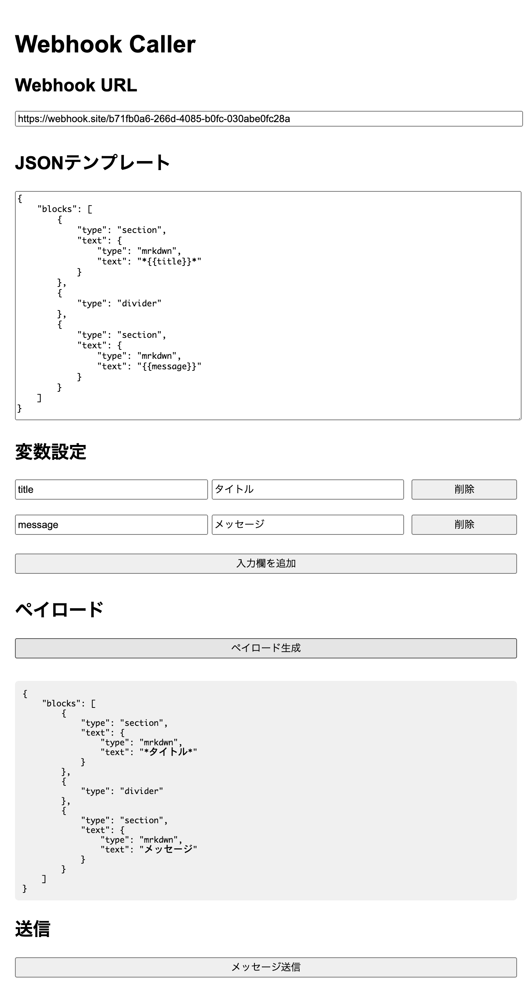
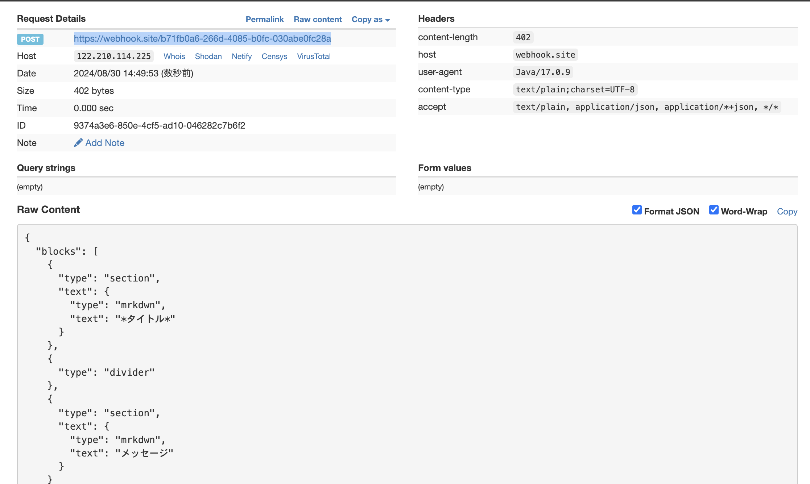

# Webhook呼び出しサンプル

JavaでWebhookを呼び出すサンプルです。

[Handlebars](https://github.com/jknack/handlebars.java)を使ってメッセージを作成し、Webhookを呼び出します。

## 画面イメージ

## 使い方

SpringBootアプリケーションとして`org.example.webhookdemo.WebhookDemoApplication`実行します。

1) ブラウザで<http://localhost:8080/>にアクセスします。
2) URLに呼び出すWebhookのURLを入力します。
3) JSONテンプレートを必要に応じて編集する。
   テンプレートは`{{}}`で囲むことで変数が設定できる
4) テンプレートに設定する変数を入力します。
5) `ペイロードを生成`ボタンをクリックします。
6) ペイロードが作成されます。（変数が実値に置き換わる）
7) `メッセージ送信`ボタンをクリックします。

## テスト

<https://webhook.site/> などのWebhookテストサイトを利用して、Webhookの呼び出しを確認します。

